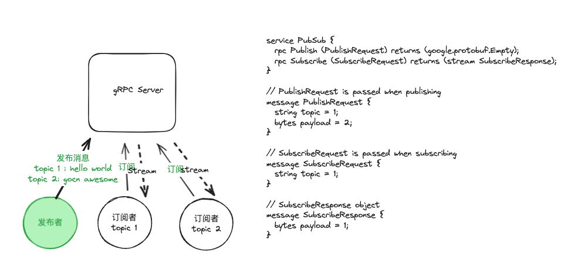
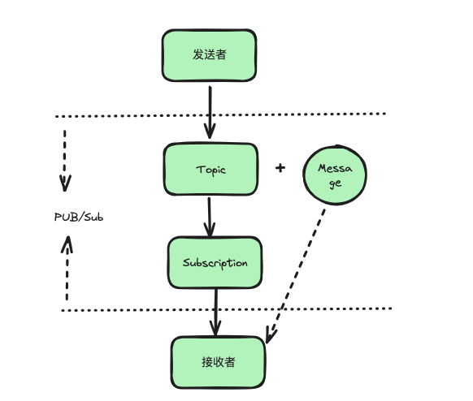

# 简介
这是一个由gRPC go实现的基于Topic的消息发布订阅系统

由三部分组成：

1. gRPC Server： 服务端监听端口，实现订阅发布接口，通过go的chan实现多客户端订阅;
2. Subscriptor: 订阅者，订阅gRPC Server的Topic，建立长连接，当订阅的Topic有消息时，会即时收到通知；
3. Publisher: 发布者，当有事件发生时，给gRPC Server发布事件，包含事件主题Topic、事件内容Payload;

# 运行
1. 启动gRPC Server服务端，监听本地端口：
   `go run main.go`
2. 启动监听者，可以有多个监听者，每个监听者监听一个Topic，当该Topic有消息产生时，会接收到从gRPC Server发过来的消息；
  `go run subclient/main.go`
3. 发布消息，产生不同Topic的消息
  `go run pubclient/main.go`

# 场景：

- 不想引入kafaka、MQ等外部组件；
- 只关注适时消息，不关注历史消息，且没有消息持久化需求；
- 适用于事件通知机制，收到某些通知后，可以触发其他动作；

# TODO
- [ ] 消息持久化
- [ ] 可靠性保障 

# 感谢

https://github.com/moby/pubsub  
https://github.com/vardius/pubsub
